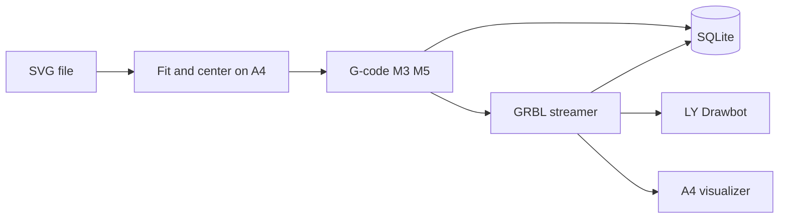

# LY Drawbot terminal plotter

The workspace at `/Users/sibongiseni/projects/plotter` is empty. This plan creates the app from scratch, informed by the machine, the two Inkscape G-code tools, and a UGS audit.

## What the machine actually is

The LY Drawbot is a CoreXY A4 kit: Arduino Uno + CNC V3 shield, CH340 USB, two steppers, **servo pen lift**. It speaks **GRBL** over serial (typically **115200**). Pen is not a real Z axis:

- **Pen down:** `M3 S1000`
- **Pen up:** `M5` (or `M3 S0`)
- **Dwell after lift/drop:** `G4 P0.1` / `G4 P0.2`
- **Travel:** `G0`/`G1` with F~3000, **draw:** `G1` with F~750–1500
- **Units / mode:** `G21` (mm), `G90` (absolute)

There are usually **no reliable homing switches**. “Home” is wherever you jog, then set work zero (`G92 X0 Y0` or GRBL `$10` / `G10 L20`). The app must remember that origin and last streamed line so a crash/shutdown can resume.

SVG Y is top-left; GRBL XY is bottom-left. Conversion **must flip Y** onto the A4 page.

## What the two conversion repos teach (do not fork)

[LY-Drawbot-Tool-by-LOD](https://github.com/love-open-design/LY-Drawbot-Tool-by-LOD) is an Inkscape plugin (`plotter-lod.py` ~1440 lines) **adapted from** [J-Tech-Photonics-Laser-Tool](https://github.com/JTechPhotonics/J-Tech-Photonics-Laser-Tool). J-Tech 2.x is a thin wrapper around `svg_to_gcode` (paths only; shapes must already be paths). LOD adds plotter defaults (`M3`/`M5`, speeds, dwells) and writes header `G90` + `G0 Z0` (Z0 is a GRBL-control visualizer trick, not needed for our TUI).

We will **reimplement a small converter** (documented functions) rather than copy those plugins or require Inkscape:

- Flatten SVG with `svgelements` (paths, lines, rects, circles, polylines; skip images/text unless already outlined)
- Uniform **scale to fit** A4 (`210 × 297 mm`) with a **5 mm margin**, then **center**
- Simple travel sort (nearest unused path start) to cut air time
- Emit LY-compatible G-code as above, then `G0 X0 Y0` and pen up

## UGS audit → [features.md](features.md)

[Universal G-Code Sender](https://github.com/winder/Universal-G-Code-Sender) is a Java/NetBeans **full CNC platform** (GRBL, FluidNC, TinyG, g2core, Smoothieware). We will document **all** product features (wiki + modules), then mark what this app implements vs skips.

Source of truth for the write-up:

- Wiki: [Features](https://github.com/winder/Universal-G-Code-Sender/wiki/Features), [Usage](https://github.com/winder/Universal-G-Code-Sender/wiki/Usage)
- Site: [universalgcodesender.com](https://universalgcodesender.com/)
- Modules in `ugs-platform/pom.xml`: visualizer, DRO, jog, console, gcode-editor, designer, joystick, toolbox, workflow, setup-wizard, ProbeModule, GcodeTools (dowel), surfacescanner/Surfacer (auto-level), filebrowser, interceptor, cloud-storage, welcome, macros/overrides in core

`features.md` will include: architecture, firmware/serial, every UI plugin, G-code processors (arc expand, comment strip, whitespace, decimals), streaming model (GRBL 128-byte character counting + `ok`/`error`/`<Idle|Run|…>` status), and an **LY Drawbot mapping table** (connect, jog, zero, send, pause, visualizer vs designer/probe/pendant we will not clone).

Implement independently; do not copy UGS Java (GPL).

## App we will build (simple TUI)

**Stack:** Python 3.11+, [Textual](https://textual.textualize.io/) TUI, `pyserial`, `svgelements`, stdlib `sqlite3`.

**On-screen always:** connection **CONNECTED / DISCONNECTED**, port, baud, work XY, machine state (`Idle`/`Run`/`Alarm`), pen up/down, current drawing + line progress.

**Commands (keyboard + command palette):** list ports, connect/disconnect, jog XY (small/large step), pen up/down, set home (zero work coords + save), convert SVG, preview, plot, pause, resume from last SQLite line, abort (feed hold `!` + reset `Ctrl-X` + pen up).

**Visualizer (possible in a terminal):** a Textual widget that draws the A4 rectangle, travel vs draw strokes (two styles), and a live pen marker. Not OpenGL; good enough to see placement and progress.

**SQLite** (`~/.lyplotter/plotter.db` or `./data/plotter.db`):

- `settings`: last port, baud, feed rates, pen commands, home_x/home_y (work origin memory)
- `drawings`: source SVG, generated G-code path, status (`converted`/`running`/`paused`/`done`/`failed`)
- `progress`: drawing_id, last_ok_line, last_x, last_y, pen_down, updated_at

On start, if a drawing is `running`/`paused`, offer **Resume**. Resume: reconnect, pen up, `G0` to last XY, continue from `last_ok_line + 1`.

**Streaming:** GRBL character-counting buffer (128 bytes), parse `ok`/`error`/`<...|WPos:...|MPos:...>` (`?` poll ~5 Hz). Soft-reset on connect like UGS.

## Layout (keep it small)

- [setup.sh](setup.sh) — create venv, `pip install -r requirements.txt`, `python -m lyplotter` (or `./setup.sh run`)
- [requirements.txt](requirements.txt)
- [features.md](features.md) — full UGS audit
- [README.md](README.md) — CH340 note, paper origin (bottom-left after Set Home), workflow
- `lyplotter/`
  - `__main__.py` — TUI entry
  - `svg_layout.py` — A4 fit/center, Y-flip
  - `gcode.py` — path → G-code
  - `grbl.py` — serial, status, stream, jog
  - `store.py` — SQLite
  - `tui.py` — Textual screens + visualizer
- `tests/` — layout math + G-code header/pen commands (no hardware)

Every public function gets a docstring (purpose, args, returns). Config defaults match LOD: travel 3000, draw 750, `M3 S1000` / `M5`, 5 mm margin, A4 210×297.

**Out of scope (UGS features we document but do not build):** designer/CAD, DXF, probing, auto-level, joystick, web pendant, G2/TinyG/Smoothie, 3D OpenGL, cloud storage.

## Verification

No plotter in this environment: unit-test conversion (centered bbox inside A4, M3/M5 present) and mock serial streaming. After you plug in the Drawbot: `setup.sh`, connect, jog, set home, convert a simple SVG, plot a small square.

